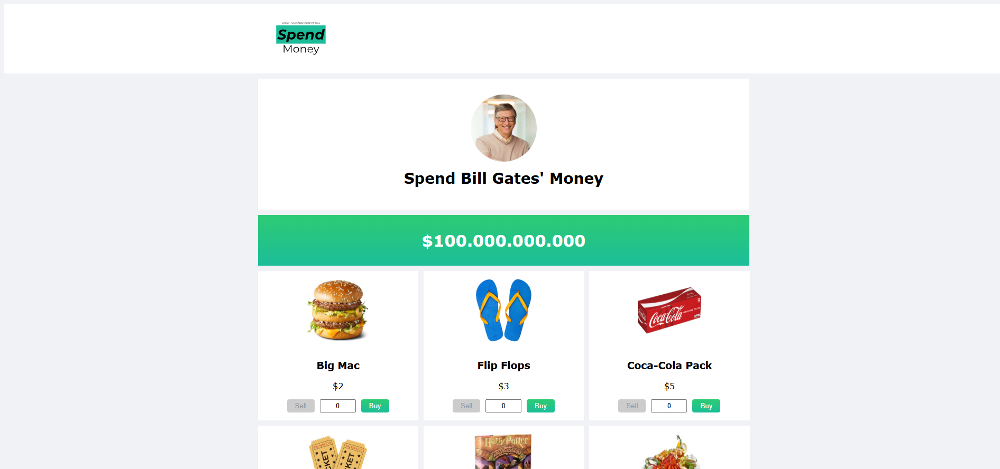
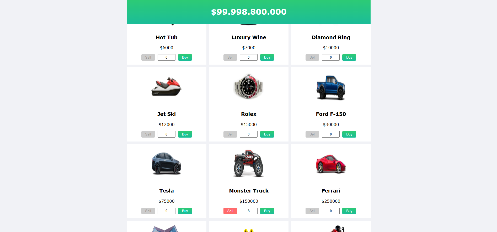
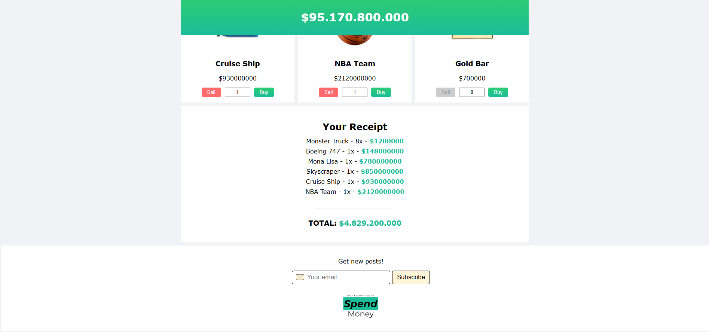

# Spend Bill Gates Money

Bu React tabanlı uygulama, kullanıcıların sanal olarak Bill Gates'in servetini harcayabileceği etkileşimli bir alışveriş simülasyonudur. Uygulamada çeşitli ürünler satın alınabilir, geri satılabilir ve toplam harcama anlık olarak takip edilebilir.


## Proje Özellikleri

- ✅ 100 milyar dolarlık sanal bütçe
- ✅ Gerçek zamanlı bütçe animasyonu
- ✅ Satın alma ve satma işlemleri
- ✅ Ürün miktarını doğrudan girme özelliği
- ✅ Anlık olarak güncellenen fiş özeti
- ✅ Modern, sade kullanıcı arayüzü


## Bileşenler

- **Header**: Logo içeren üst menü.
- **Hero**: Bill Gates görseli ve başlık içeren tanıtım alanı.
- **Products**: Ürünlerin listelendiği ve satın alma/satma işlemlerinin yapıldığı ana bileşen. Bütçe animasyonu ve fiş özeti bu alanda yer alır.
- **Footer**: Sayfa alt bilgilerini içerir.


## Kullanılan Teknolojiler

- React (Fonksiyonel bileşenler ve Hooks)
- useState, useEffect
- CSS Modules (`Header.css`, `Hero.css`, `Products.css` ...)
- Yerel veri yönetimi (`data.js` üzerinden ürünler)


## Kurulum

```bash
# Projeyi klonlayın
git clone [https://github.com/emreykaya/w10-bill-gates-money-app]

# Proje dizinine gidin
cd w10-bill-gates-money-app

# Bağımlılıkları yükleyin
npm install

# Uygulamayı başlatın
npm run dev
```


## Ekran Görüntüsü
    



